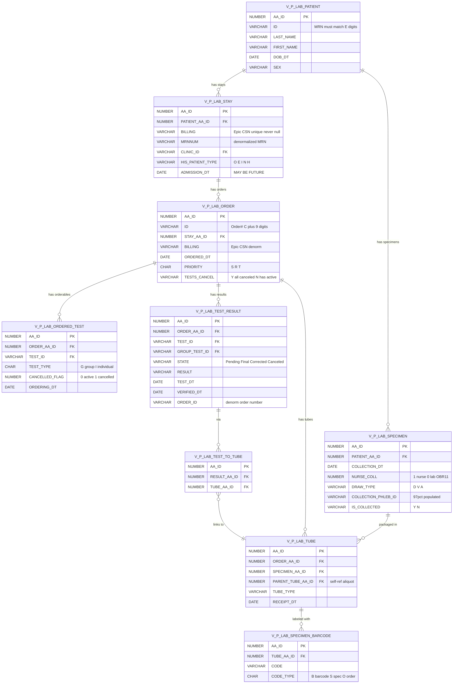
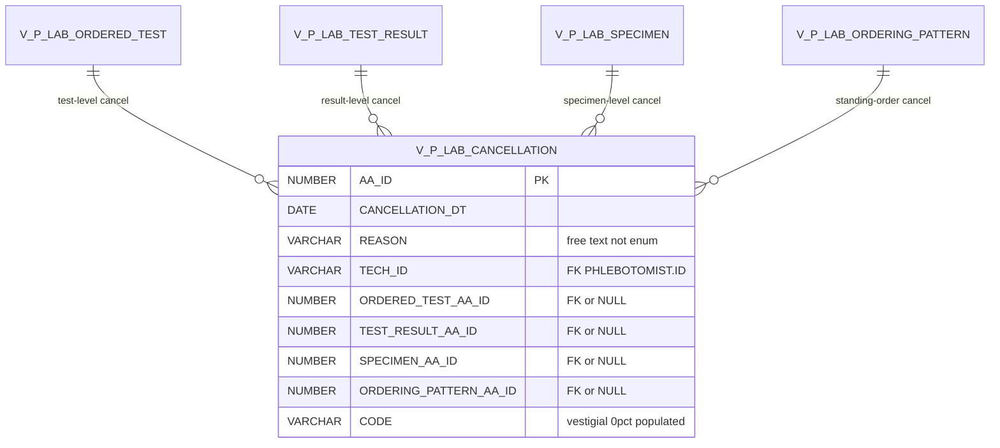
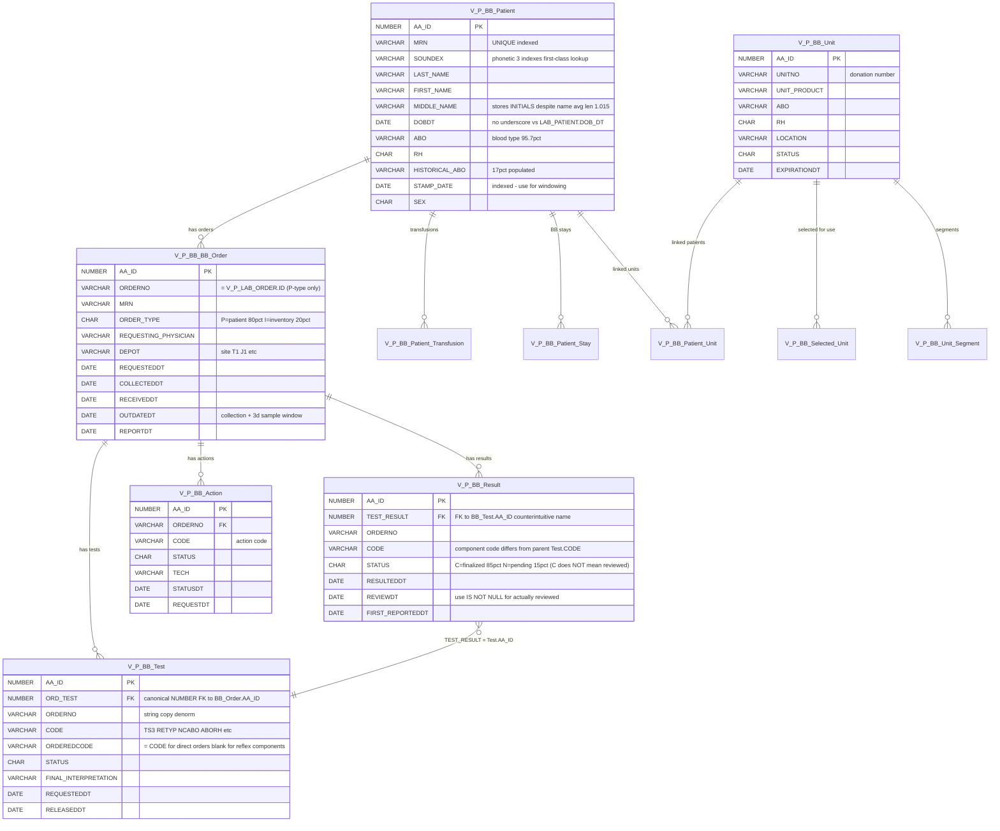
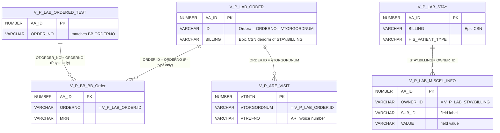
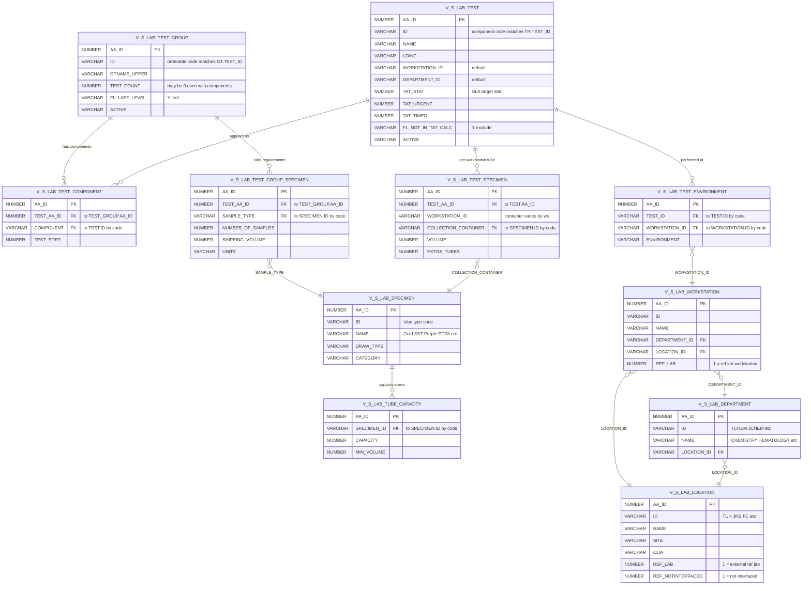
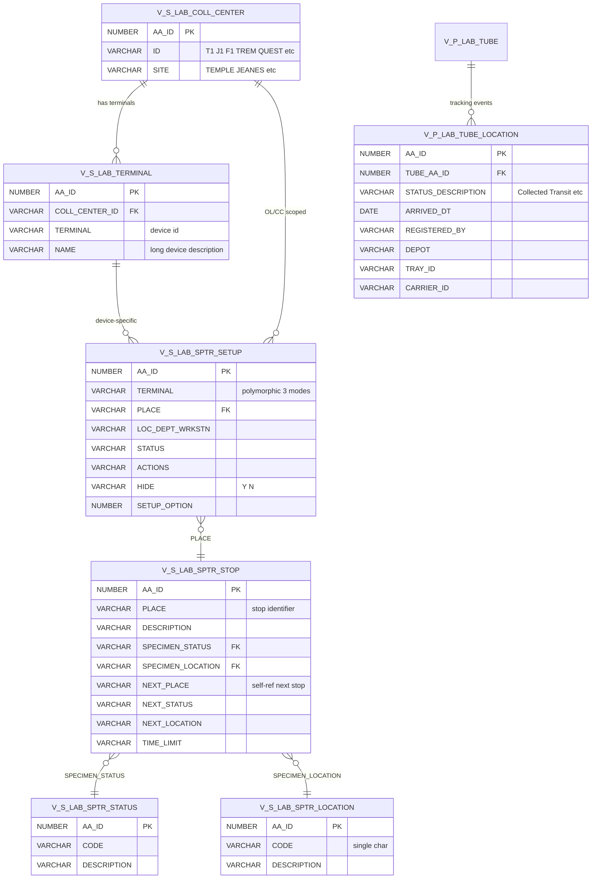
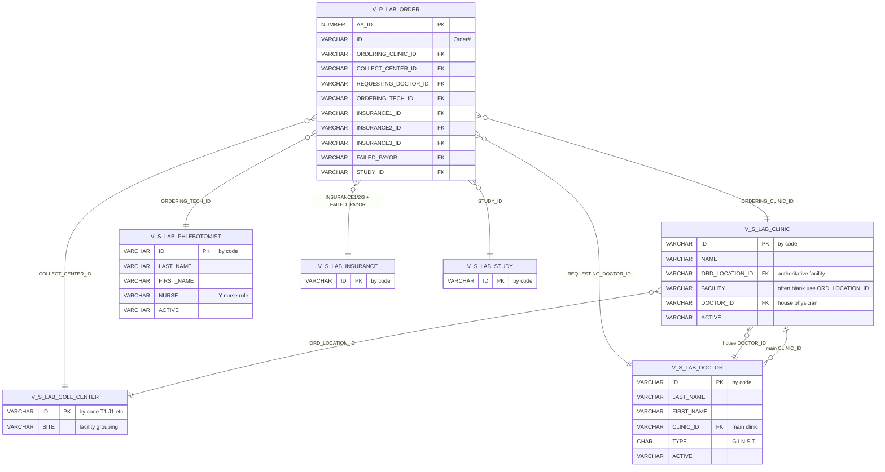
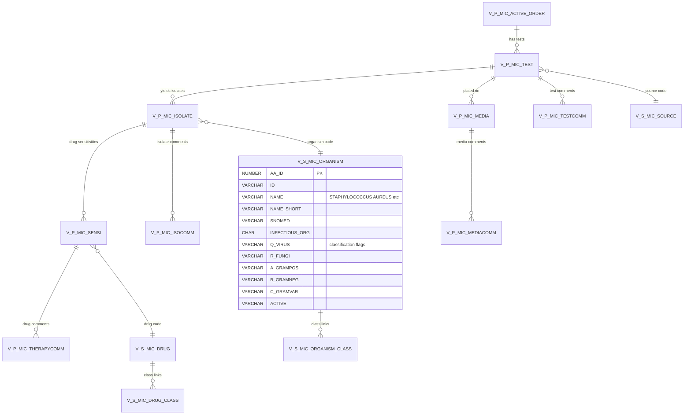
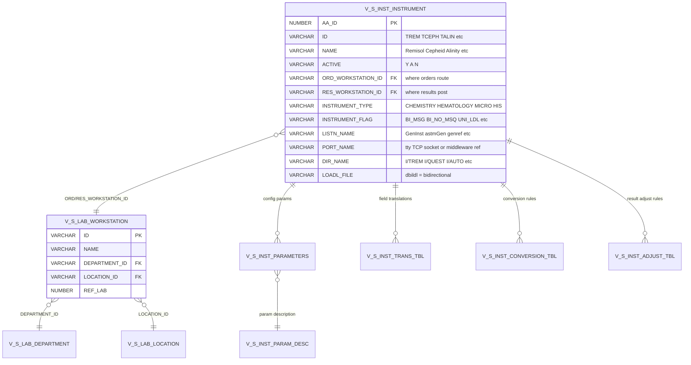
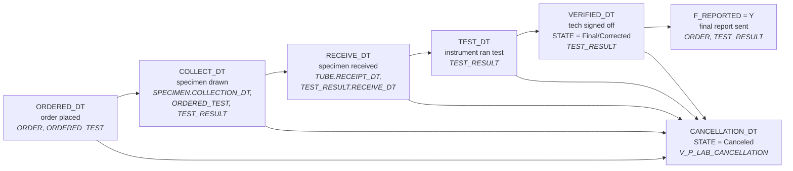

# SCC Soft Computer LIS — Schema Diagrams

Visual relationship maps for the [SCC data dictionary](claude.md). Render in VS Code with the Mermaid Preview extension, or any Markdown viewer that supports Mermaid.

Each diagram shows **PK + FK + key filter columns only** — for full column detail and operational caveats, consult [claude.md](claude.md). Annotations highlight the gotchas most likely to bite a query author (sentinel values, vestigial flags, cancellation fan-out, etc.).

**Diagrams in this file:**
1. [Core SoftLab Patient-Data Chain](#1-core-softlab-patient-data-chain)
2. [Cancellation Fan-Out](#2-cancellation-fan-out-discriminated-union)
3. [SoftAR Billing Module](#3-softar-billing-module)
4. [Blood Bank Module (SoftBank)](#4-blood-bank-module-softbank)
5. [Cross-Module Bridges (Lab ↔ BB ↔ AR)](#5-cross-module-bridges)
6. [SoftLab Test Setup / Compendium Hierarchy](#6-softlab-test-setup--compendium-hierarchy)
7. [Specimen Tracking (SPTR) Cluster](#7-specimen-tracking-sptr-cluster)
8. [Order Decorator Reference Graph](#8-order-decorator-reference-graph)
9. [Microbiology (SoftMic) Cluster — preliminary](#9-microbiology-softmic-cluster--preliminary)
10. [Instrument Interface Map](#10-instrument-interface-map)
11. [Order Lifecycle Timeline](#11-order-lifecycle-timeline)

---

## 1. Core SoftLab Patient-Data Chain

The everyday join graph for clinical / TAT / specimen queries. Shows how a patient's lab work flows from encounter → order → orderable → result, with parallel specimen → tube → barcode tracking.

**Operational notes**
- **MRN filter is mandatory** on every query touching `PATIENT.ID` — `REGEXP_LIKE(p.ID, '^E[0-9]+$')` excludes test/fake patients
- **`STATE IN ('Final', 'Corrected')` is the standard "real result" filter** — half of recent `V_P_LAB_TEST_RESULT` rows are `Canceled` (panel fan-out)
- **`VERIFIED_FLAG` persists 'Y' through cancellation** — don't use as a "final results" filter; use `STATE` instead
- **`tr.TAT` is the SLA target from setup, NOT measured TAT** — compute measured TAT from `VERIFIED_DT - RECEIVE_DT`
- **`ADMISSION_DT` can be in the FUTURE** — Epic posts pre-scheduled visits up to ~5 months ahead. Use downstream timestamps (`ORDERED_DT`, `VERIFIED_DT`) for "actual work" date filtering
- **`V_P_LAB_SPECIMEN.ORDER_AA_ID` is vestigial** — use `V_P_LAB_TUBE.ORDER_AA_ID` for the specimen→order link
- **`OT ↔ TR` join uses three columns**: `ot.ORDER_AA_ID = tr.ORDER_AA_ID AND ot.TEST_ID = tr.GROUP_TEST_ID AND ot.WORKSTATION_ID = tr.ORDERING_WORKSTATION_ID`
- **Filter `sb.CODE_TYPE = 'B'`** for barcodes (vs `'S'` specimen-id, `'O'` order#)

---

## 2. Cancellation Fan-Out (Discriminated Union)

`V_P_LAB_CANCELLATION` has FOUR FK columns — exactly one is non-null per row. The populated FK identifies what level was cancelled. **Joining only one FK silently skips the other three categories.**

**Operational notes**
- **Exactly one FK populated per row** — the other three are NULL. The populated FK is the discriminator.
- **`INNER JOIN` on `TEST_RESULT_AA_ID`** matches only result-level cancellations (~98% are 1:1 with results — won't inflate row counts). Fine for "cancelled results" reports, **wrong for "cancelled orders" reports**.
- For order-level cancellation reporting, join on `ORDERED_TEST_AA_ID` or use `V_P_LAB_ORDERED_TEST.CANCELLED_FLAG = 1`.
- **`REASON` is free text with a partial canned vocabulary** — top values include "Test Not Performed. Specimen Never Received", "Patient Discharge", "Duplicate request.", and many case/whitespace variants. Normalize with `TRIM(UPPER(REASON))` for grouping.
- **`CODE` field is empty (0%)** in this deployment — schema slot, never written.
- **PHI caveat**: `REASON` frequently contains nurse names, patient context, free narrative. Treat as PHI-adjacent.
- ~60.7M rows since 2016, ~17K cancellations/day.

---

## 3. SoftAR Billing Module

Visit → Item → CCI/Billrules chain for billing analytics. Visits link back to SoftLab via `VTORGORDNUM = V_P_LAB_ORDER.ID`.

**Operational notes**
- **All money fields are stored in cents** — divide by 100 for dollars (`ITPRICE`, `ITBAL`, `INCHARGE`, `INDUEAMT`, `VTCHARGE`, `TRAMT`)
- **PK convention is `*INTN`** in SoftAR (not `AA_ID`); status flags use `*STAT = 0` for active
- **`ITCCITINTN` points to col-1 ITEM.ITINTN** (not `V_S_ARE_CCI.CCINTN`) when populated and non-zero — the column-1 row is the parent of the column-2 row in a CCI pair
- **`V_P_ARE_BILLERROR` is visit-level, not item-level** — join on `BERVTINTN = VTINTN`. When `BERCODE` is NULL, treat as `'IN75'` for `V_S_ARE_ARERROR` lookup
- **Uninvoiced visits** (`VTINVDT IS NULL`) have **zero items** in `V_P_ARE_ITEM` — visit shells only
- **Cross-module link** to SoftLab: `V_P_ARE_VISIT.VTORGORDNUM = V_P_LAB_ORDER.ID`

---

## 4. Blood Bank Module (SoftBank)

Order → Result → Test, plus units, actions (transfusions/crossmatch), and patient demographics. Joins to SoftLab via `ORDERNO = V_P_LAB_ORDER.ID`.

**Operational notes**
- **Cross-module join key is `ORDERNO`** (VARCHAR2 11) — matches `V_P_LAB_ORDER.ID` exactly. **Only `ORDER_TYPE='P'` (patient, ~80%) BB orders have a matching Lab order; `ORDER_TYPE='I'` (inventory, ~20%) do not** — INNER JOIN to V_P_LAB_ORDER silently drops the inventory side
- **`V_P_BB_Result.TEST_RESULT` is an FK to `V_P_BB_Test.AA_ID`** (not test result content; counterintuitive naming)
- **`V_P_BB_Test.ORD_TEST` is the canonical NUMBER FK to `V_P_BB_BB_Order.AA_ID`** — more efficient than the ORDERNO string-match
- **STATUS enums are view-specific:**
  - V_P_BB_Test: blank (87%) / `N` (13%) — `N` likely "in-flight unreleased"
  - V_P_BB_Result: `C` (85%) / `N` (15%) — `C` is "finalized" but **NOT necessarily reviewed**; use `REVIEWDT IS NOT NULL` for actually-reviewed filtering
- **Multi-component test fanout** — one V_P_BB_Test row can produce multiple V_P_BB_Result rows with different CODEs:
  - `TS3` → `ABORH` + `AS3` (1:2)
  - `CORD` → `CRH` + `CABO` + `CDAT` (1:3); `NCORD` → `CRH` + `CABO` (1:2, no CDAT)
  - `HEEL` → 4 components; `STDA`/`UNIT1` → 3-4
  - `PRET1` → 8 components; `TRX1` → 9 components (largest fanout — Transfusion Reaction workup)
- **V_P_BB_Patient is built for phonetic lookup** — SOUNDEX has 3 dedicated indexes (alone, with DOB+TOB, with SSN). Patient name searches should consider Soundex-based fuzzy matching, not just `LIKE`
- **Vestigial columns observed across BB views** (verified via deep-probe):
  - V_P_BB_BB_Order: `ORDERTYPE`, `PATIENTTYPE` (always blank — distinct from `ORDER_TYPE`)
  - V_P_BB_Test: `TEST_TYPE` (always blank)
  - V_P_BB_Patient: `SITE`, `DOD`, `LAST_DISCHARGE_DATE`, `PDF`, `EXTERNALID`, `CLIENTID`, `TITLE`, `CASENO` (all 0%); `NEXT_MRN`/`AUXILIARY_MRN` are placeholder constants
- **V_P_BB_Patient.MOTHER_MRN is sparsely real** — ~3% of patients (newborns) have a real mother's MRN; the rest carry a 1-char placeholder. Filter `LENGTH(MOTHER_MRN) > 1` to find real linkages
- **V_P_BB_Patient base-table column naming differs** — view exposes friendly names; base table `BBANK_PATIENT` uses P-prefix (PLNAME, PFNAME, PDOB, PSDX, PTSTAMP, etc.). `PTOB` (time of birth) exists in base but **not in the view**

---

## 5. Cross-Module Bridges

How a single patient encounter spans Lab, Blood Bank, and AR via shared identifiers.

**Operational notes**
- **Three identifier shapes worth knowing:**
  1. **Order number** (`V_P_LAB_ORDER.ID`, VARCHAR2 11, format `C` + 9 digits) — matches `V_P_BB_BB_Order.ORDERNO` and `V_P_ARE_VISIT.VTORGORDNUM` exactly
  2. **Epic CSN** (`V_P_LAB_STAY.BILLING`, VARCHAR2 23, ~9-digit numeric) — denormalized to `V_P_LAB_ORDER.BILLING`. Unique per stay, never null
  3. **AR invoice number** (`V_P_ARE_VISIT.VTREFNO`) — separate from CSN, internal to billing
- **`V_P_LAB_MISCEL_INFO` is keyed by Epic CSN** (`OWNER_ID = STAY.BILLING`) — used to attach arbitrary HIS-pushed metadata to a stay (e.g., expected discharge date)
- **One Epic CSN can produce multiple lab orders** (each with its own `V_P_LAB_ORDER.ID`); each lab order maps 1:1 to at most one BB order and 1:1 to at most one AR visit
- **Same `BILLING` value lives on both `STAY` and `ORDER`** — same identifier, denormalized for query convenience. Querying for CSN context can stop at either level
- **Lab ↔ BB cross-link only fires for `ORDER_TYPE='P'`** — ~80% of BB orders link back to a SoftLab order (patient-context). The other ~20% are inventory orders (`ORDER_TYPE='I'`: donor processing, unit operations, QC) with no Lab counterpart. INNER JOIN on ORDERNO silently drops the inventory side; use LEFT JOIN or filter `ORDER_TYPE` explicitly

---

## 6. SoftLab Test Setup / Compendium Hierarchy

The configuration tables that drive what tests can be ordered, what tubes they require, and where they're performed. Read top-down: a `TEST_GROUP` (orderable like `CMP`) is composed of `TEST` components (Na, K, Cl…); each side carries its own specimen-requirement and workstation-mapping tables.

**Operational notes**
- **Two-tier test model**: `TEST_GROUP` is what gets *ordered* (e.g., `CMP`); `TEST` is what gets *resulted* (component analytes). The bridge is `V_S_LAB_TEST_COMPONENT`. `V_P_LAB_ORDERED_TEST.TEST_ID` matches `TEST_GROUP.ID`; `V_P_LAB_TEST_RESULT.TEST_ID` matches `TEST.ID` (with `GROUP_TEST_ID` carrying the parent).
- **Specimen requirements live on TWO tables** with different granularity:
  - `V_S_LAB_TEST_GROUP_SPECIMEN` — at the **orderable** level, lists all tubes needed for the panel as a whole
  - `V_S_LAB_TEST_SPECIMEN` — at the **test + workstation** level, lets one component require different containers at different sites (e.g., PTSEC uses BLUE most places but BLUPLAS at TCOAG)
- **Use `TEST_GROUP_SPECIMEN` first; fall back to `TEST_SPECIMEN`** when a group has no rows in the group-level table — common for individual-orderable tests where the only spec is at the component level.
- **Tube name lookup** always goes through `V_S_LAB_SPECIMEN` (ID → NAME). `V_S_LAB_TUBE_CAPACITY` is for capacity / min-volume specs only — not a name lookup.
- **`TEST_ENVIRONMENT` is a many-to-many bridge** — a single test can be performed at multiple workstations across facilities. Used to answer "which labs perform test X" by chaining `TEST_ENVIRONMENT.WORKSTATION_ID → V_S_LAB_WORKSTATION.LOCATION_ID → V_S_LAB_LOCATION.SITE`.
- **Ref-lab tests are identified two ways**: `V_S_LAB_LOCATION.REF_LAB = 1` (external lab as a location) and `V_S_LAB_WORKSTATION.REF_LAB = 1` (the workstation that represents the send-out destination). Filter `REF_NOTINTERFACED = 1` to find non-interfaced (paper-result) ref labs.
- **TAT columns on `V_S_LAB_TEST` are SLA targets** (`TAT_STAT`, `TAT_URGENT`, `TAT_TIMED`) — not measured TAT. Same foot-gun as on the transactional `tr.TAT`. Always compute measured TAT from date arithmetic.
- **`FL_NOT_IN_TAT_CALC = 'Y'` excludes a test from TAT reports** — important filter for measured-TAT analytics so configuration-excluded tests don't skew aggregates.
- **CPT codes are NOT here** — `V_S_LAB_TEST.CPT_BASIC_CODE_1..8` columns are unpopulated in this deployment. Use `V_S_ARE_BILLRULES.BRCPTCODE` (joined via `BRTSTCODE = V_S_LAB_TEST.ID`) for authoritative CPT.

---

## 7. Specimen Tracking (SPTR) Cluster

The configuration that drives the per-terminal Specimen Tracking screens, plus the runtime events recorded in `V_P_LAB_TUBE_LOCATION`. Used for diagnosing "broken terminal" support tickets where one PC sees different SPTR options than another at the same site.

**Operational notes**
- **`V_S_LAB_SPTR_SETUP.TERMINAL` is polymorphic — three modes:**
  1. A specific device ID → `V_S_LAB_TERMINAL.TERMINAL` (device-specific override; rare in practice)
  2. An OL/CC code → `V_S_LAB_COLL_CENTER.ID` (e.g., `T1`, `J1`, `F1`, `TREM`, `QUEST` — most rows live here)
  3. Literal `*` → globally-scoped fallback
  Resolution: a device inherits its OL/CC rows + global rows + any device-specific overrides. Device-specific rows take precedence.
- **`V_S_LAB_SPTR_STOP` self-references via `NEXT_PLACE` / `NEXT_STATUS` / `NEXT_LOCATION`** — defines the workflow chain (where a specimen goes after this stop). Not drawn on the diagram (renderer doesn't support self-refs cleanly); resolve manually with `b.PLACE = a.NEXT_PLACE`.
- **Diagnostic workflow for "broken terminal" tickets** (per SCC manual):
  1. Get the PC's terminal ID from SoftLab client (Help → About) — not stored in the DB.
  2. `V_S_LAB_TERMINAL` — confirm registered with the right `COLL_CENTER_ID`.
  3. `V_S_LAB_SPTR_SETUP WHERE TERMINAL = <device id>` — device-specific rows (often empty).
  4. `V_S_LAB_SPTR_SETUP WHERE TERMINAL = <coll_center_id>` — OL/CC-inherited rows.
  5. `V_S_LAB_SPTR_SETUP WHERE TERMINAL = '*'` — global rows.
  6. If two PCs share `COLL_CENTER_ID` and neither has device-specific rows, SPTR config is identical — the problem is outside SCC (client INI, hostname mis-registration, printer drivers, etc.).
- **`V_P_LAB_TUBE_LOCATION` is the runtime event log** — one row per tracking event (`Collected`, `Transit`, `Run on Instrument`, `Resulted`, `Ordering`). Filter `STATUS_DESCRIPTION = 'Transit'` to find specimens physically moved between facilities.
- **`TRAY_ID` / `CARRIER_ID` / `LINE_CODE` / `OUTLET_CODE`** are populated for automation-line events (Roche/Beckman track-routed specimens) — useful for instrument-routing audits.

---

## 8. Order Decorator Reference Graph

The lookup tables that resolve the `*_ID` code columns on `V_P_LAB_ORDER`. Each edge is a join-by-code (the order column holds the code value, the lookup view's `ID` column is the match target).

**Operational notes**
- **All FKs in this graph are by code**, not numeric `AA_ID` — the lookup PKs are `ID` (varchar code) and the order columns hold the matching code value. `JOIN V_S_LAB_DOCTOR d ON d.ID = o.REQUESTING_DOCTOR_ID`.
- **`V_S_LAB_CLINIC.ORD_LOCATION_ID` is the authoritative facility grouping**, not `FACILITY` (which is often blank). Resolves to `V_S_LAB_COLL_CENTER.ID`.
- **`V_S_LAB_DOCTOR.TYPE` enum**: `G`=Doctor Group, `I`=Institution, `N`=Non-staff, `S`=Staff, `T`=Temporary.
- **`V_S_LAB_PHLEBOTOMIST` is a 57-row table** — does NOT cover the full collector workforce. ~9% of active collectors have rows here; most flow through Epic/HIS and bypass the table. Don't treat it as the authoritative collector roster — see the project memories on the three-signal collector classifier.
- **`V_S_LAB_PHLEBOTOMIST.NURSE = 'Y'` is accurate where populated**, but populated for ~2% of actual collectors. Use as a narrow high-confidence overlay, never as the primary nurse-vs-phleb classifier — for that, prefer `V_P_LAB_SPECIMEN.NURSE_COLL` (HL7 OBR[11]).
- **Generic phleb codes** in `V_S_LAB_PHLEBOTOMIST.ID`: `PHLEB` (default phlebotomist), `NUR` (nursing-staff), `PHY` (physician), `PAT` (patient), `UNK` (unknown), `SCC` (system testing only). These are role markers, not real users.
- **`V_P_LAB_STAY` and `V_P_LAB_ORDERED_TEST` carry their own copies of these `*_ID` columns** — same code-FK pattern. The ordered-test layer often has the live data when `V_P_LAB_ORDER`'s column is blank (e.g., `MEDICAL_SERVICE_ID` mostly empty on ORDER, populated as `ORDERING_SERVICE_ID` on ORDERED_TEST).

---

## 9. Microbiology (SoftMic) Cluster — preliminary

> ⚠️ **Preliminary diagram — relationships inferred from view names; not directly verified.** Most MIC FK columns are not yet documented at the column level in the dictionary. Treat this as a starting point for query design; verify joins with discovery probes before relying on them in production reports.

**Operational notes (preliminary)**
- **Verification needed for all FK columns** — the join keys for `V_P_MIC_TEST → V_P_MIC_ACTIVE_ORDER`, `V_P_MIC_ISOLATE → V_P_MIC_TEST`, `V_P_MIC_SENSI → V_P_MIC_ISOLATE`, etc. are inferred from naming conventions, not directly probed. Run a discovery probe before writing production queries.
- **Organism type is derived from classification flags** on `V_S_MIC_ORGANISM`, not a single TYPE column: `Q_VIRUS` / `O1VIRUS` (virus), `R_FUNGI` (fungus, includes yeasts like Candida), `A_GRAMPOS` / `B_GRAMNEG` / `C_GRAMVAR` (gram stain), `N_COCUS` / `O_BACILLUS` (morphology).
- **Genus / species are not stored separately** — parse from `V_S_MIC_ORGANISM.NAME` with `REGEXP_SUBSTR` if needed.
- **Sensitivity panel flags** on `V_S_MIC_ORGANISM` (single-letter columns S, T, U, V, W, X, Y, Z, A1–Z1, etc.) determine which drug panels apply to that organism — schema-heavy but undocumented at column level.
- **Cross-link to SoftLab**: micro orders share the same `V_P_LAB_ORDER` ancestry as chem/heme orders — micro-flagged orders carry `V_P_LAB_ORDER.BACTITEST = 'Y'`. Component results land in `V_P_LAB_TEST_RESULT` like normal; the MIC views overlay culture / isolate / sensitivity detail on top.
- **Cancellation fan-out applies to micro tests too** — see diagram #2; `V_P_LAB_CANCELLATION.ORDERED_TEST_AA_ID` covers cancelled cultures.

---

## 10. Instrument Interface Map

How interfaced analyzers (chemistry, hematology, micro, molecular) and HIS infrastructure connect to the SoftLab workstation / department / location hierarchy. Each `V_S_INST_INSTRUMENT` row is a configured driver / interface.

**Operational notes**
- **Two workstation FKs from a single instrument row** — `ORD_WORKSTATION_ID` (where orders route for the analyzer) and `RES_WORKSTATION_ID` (where results post). They often match for direct analyzers; they diverge for middleware-routed instruments. Diagram collapses both into one edge for renderer simplicity; both columns are listed in the entity body.
- **`ACTIVE = 'A'` (not `'Y'`)** for auto-services and server processes (auto-reporting, RBS, label servers, monitoring). Standard active analyzers use `'Y'`. `'N'` = retired / inactive.
- **`INSTRUMENT_TYPE = 'HIS'` rows are NOT analyzers** — they're system-infrastructure interfaces (ADT, order entry, billing, ESB, auto-reporting, label servers). Filter these out for analyzer-only queries: `WHERE INSTRUMENT_TYPE IN ('CHEMISTRY','HEMATOLOGY','MICROBIOLOGY')`.
- **Middleware shared-connection pattern**: many physical analyzers route through one logical interface row. Beckman AU / DxC / Access at TUH all flow through `TREM` (Remisol). Same pattern at JNS (`JREM`), Episcopal (`EREM`), Fox Chase (`FREM`), W&F (`WFREM`). Use `PORT_NAME` and `INST_DEP_1` / `INST_DEP_2` to spot middleware dependencies.
- **Reference-lab interfaces** use `LISTN_NAME = 'genref'` and `DIR_NAME` like `I/QUEST`, `I/TVCOR`, `I/HIST` — separate Quest, Viracor, HistoTrac connections.
- **`LOADL_FILE = 'dbildl'`** indicates bidirectional download (LIS → instrument). Unidirectional instruments (results-only) have a different `LOADL_FILE` or none.
- **Date columns are stored as YYYYMMDD NUMBER, not Oracle DATE** — `CREATE_DATE` and `MOD_DATE` need `TO_DATE(TO_CHAR(CREATE_DATE), 'YYYYMMDD')` for date arithmetic.
- **Satellite tables** (`V_S_INST_PARAMETERS`, `V_S_INST_TRANS_TBL`, `V_S_INST_CONVERSION_TBL`, `V_S_INST_ADJUST_TBL`) hold per-instrument configuration — most query work doesn't touch them.

---

## 11. Order Lifecycle Timeline

How an order's timestamps progress from placement to reported result, and where each `*_DT` column lives. Useful for picking the right column for a given TAT measurement and for spotting where cancellations interrupt the chain.

**Operational notes**
- **Standard measured TAT** = `VERIFIED_DT - RECEIVE_DT` (specimen-receipt to result). This is the SLA-relevant interval for most reports; ignore the `tr.TAT` column — that's the *target*, not the measured value.
- **Other useful intervals:**
  - `RECEIVE_DT - COLLECT_DT` — specimen-transit time
  - `TEST_DT - RECEIVE_DT` — wait time at the analyzer
  - `VERIFIED_DT - TEST_DT` — instrument-run-to-verification
  - `VERIFIED_DT - ORDERED_DT` — order-to-result (door-to-door)
- **Each timestamp lives on multiple views** (denormalized for query convenience):
  - `COLLECT_DT` — canonical on `V_P_LAB_SPECIMEN.COLLECTION_DT`; denormalized to `V_P_LAB_ORDERED_TEST.COLLECTED_DT` and `V_P_LAB_TEST_RESULT.COLLECT_DT`
  - `RECEIVE_DT` — canonical (per-tube) on `V_P_LAB_TUBE.RECEIPT_DT`; denormalized to `V_P_LAB_ORDERED_TEST.RECEIVED_DT` and `V_P_LAB_TEST_RESULT.RECEIVE_DT`
  - `VERIFIED_DT` lives only on `V_P_LAB_TEST_RESULT` (no parent-level rollup)
- **Numeric / DATE triple pattern**: most timestamps have a `*_DATE` (NUMBER, YYYYMMDD), `*_TIME` (NUMBER, HHMM), and `*_DT` (DATE) trio. **Always use the `*_DT` column** — it composes the two and handles the `-1` "not set" sentinel correctly.
- **`ADMISSION_DT` is NOT in this chain** — it sits on `V_P_LAB_STAY` and can be in the FUTURE (Epic posts pre-scheduled visits up to ~5 months ahead). Don't use it as a "did this happen" filter; use a downstream timestamp like `ORDERED_DT` or `VERIFIED_DT`.
- **Cancellation can fire at any point** after order placement and before final report. The cancellation row in `V_P_LAB_CANCELLATION` records `CANCELLATION_DT` plus exactly one of four FK columns identifying the level (order / result / specimen / standing-pattern — see diagram #2). State on the relevant test-result rows flips to `Canceled`.
- **`UNVERIFIED_DT` rolls back from `VERIFIED_DT`** — when a posted result is un-verified for amendment, the `UNVERIFIED_DT` column on `V_P_LAB_TEST_RESULT` records the rollback. The eventual re-verification updates `VERIFIED_DT` again. Useful for amendment-audit reports.
- **Pre-collection ordering**: orders for not-yet-drawn specimens carry `TO_BE_COLLECT_DT` (`V_P_LAB_PENDING_RESULT`) as the planned collection time — distinct from actual `COLLECT_DT`.

---

## Update procedure

When discoveries change schema understanding (column additions, FK corrections, new gotchas), update [claude.md](claude.md) for the column detail and **also reflect the change here** if it affects the visual relationship map. Keep the diagrams focused — don't add columns just because they exist; add them only if a query author would benefit from seeing them next to the relationship arrows.
