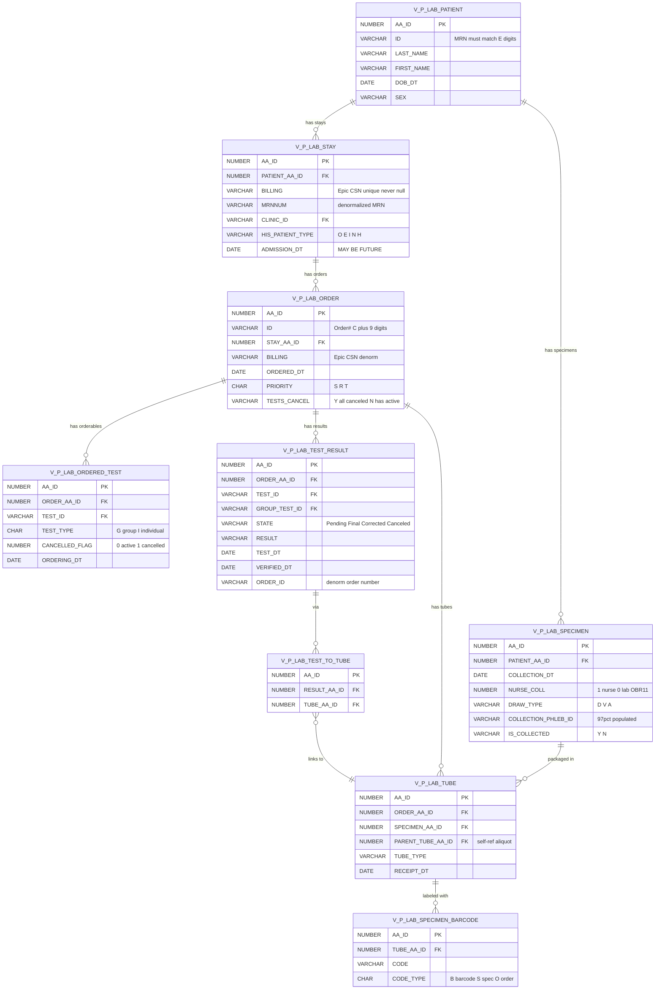
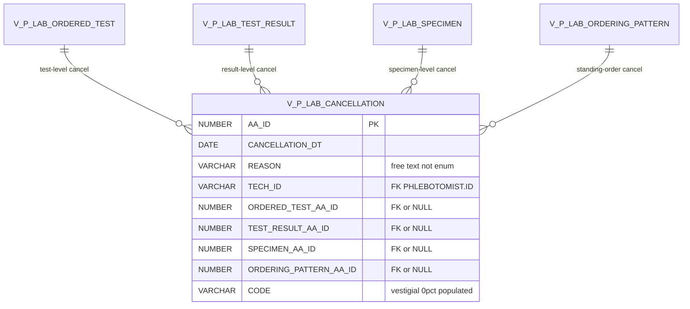
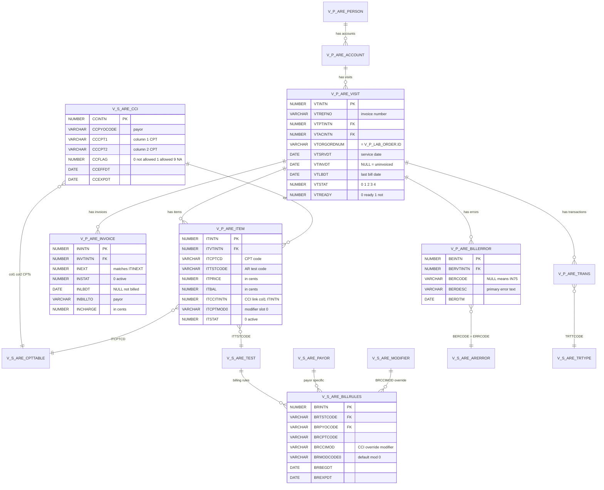
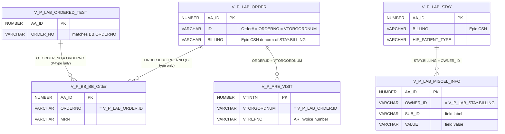

# SCC Soft Computer LIS — Schema Diagrams

Visual relationship maps for the [SCC data dictionary](claude.md). Render in VS Code with the Mermaid Preview extension, or any Markdown viewer that supports Mermaid.

Each diagram shows **PK + FK + key filter columns only** — for full column detail and operational caveats, consult [claude.md](claude.md). Annotations highlight the gotchas most likely to bite a query author (sentinel values, vestigial flags, cancellation fan-out, etc.).

**Diagrams in this file:**
1. [Core SoftLab Patient-Data Chain](#1-core-softlab-patient-data-chain)
2. [Cancellation Fan-Out](#2-cancellation-fan-out-discriminated-union)
3. [SoftAR Billing Module](#3-softar-billing-module)
4. [Blood Bank Module (SoftBank)](#4-blood-bank-module-softbank)
5. [Cross-Module Bridges (Lab ↔ BB ↔ AR)](#5-cross-module-bridges)

---

## 1. Core SoftLab Patient-Data Chain

The everyday join graph for clinical / TAT / specimen queries. Shows how a patient's lab work flows from encounter → order → orderable → result, with parallel specimen → tube → barcode tracking.

**Operational notes**
- **MRN filter is mandatory** on every query touching `PATIENT.ID` — `REGEXP_LIKE(p.ID, '^E[0-9]+$')` excludes test/fake patients
- **`STATE IN ('Final', 'Corrected')` is the standard "real result" filter** — half of recent `V_P_LAB_TEST_RESULT` rows are `Canceled` (panel fan-out)
- **`VERIFIED_FLAG` persists 'Y' through cancellation** — don't use as a "final results" filter; use `STATE` instead
- **`tr.TAT` is the SLA target from setup, NOT measured TAT** — compute measured TAT from `VERIFIED_DT - RECEIVE_DT`
- **`ADMISSION_DT` can be in the FUTURE** — Epic posts pre-scheduled visits up to ~5 months ahead. Use downstream timestamps (`ORDERED_DT`, `VERIFIED_DT`) for "actual work" date filtering
- **`V_P_LAB_SPECIMEN.ORDER_AA_ID` is vestigial** — use `V_P_LAB_TUBE.ORDER_AA_ID` for the specimen→order link
- **`OT ↔ TR` join uses three columns**: `ot.ORDER_AA_ID = tr.ORDER_AA_ID AND ot.TEST_ID = tr.GROUP_TEST_ID AND ot.WORKSTATION_ID = tr.ORDERING_WORKSTATION_ID`
- **Filter `sb.CODE_TYPE = 'B'`** for barcodes (vs `'S'` specimen-id, `'O'` order#)

---

## 2. Cancellation Fan-Out (Discriminated Union)

`V_P_LAB_CANCELLATION` has FOUR FK columns — exactly one is non-null per row. The populated FK identifies what level was cancelled. **Joining only one FK silently skips the other three categories.**

**Operational notes**
- **Exactly one FK populated per row** — the other three are NULL. The populated FK is the discriminator.
- **`INNER JOIN` on `TEST_RESULT_AA_ID`** matches only result-level cancellations (~98% are 1:1 with results — won't inflate row counts). Fine for "cancelled results" reports, **wrong for "cancelled orders" reports**.
- For order-level cancellation reporting, join on `ORDERED_TEST_AA_ID` or use `V_P_LAB_ORDERED_TEST.CANCELLED_FLAG = 1`.
- **`REASON` is free text with a partial canned vocabulary** — top values include "Test Not Performed. Specimen Never Received", "Patient Discharge", "Duplicate request.", and many case/whitespace variants. Normalize with `TRIM(UPPER(REASON))` for grouping.
- **`CODE` field is empty (0%)** in this deployment — schema slot, never written.
- **PHI caveat**: `REASON` frequently contains nurse names, patient context, free narrative. Treat as PHI-adjacent.
- ~60.7M rows since 2016, ~17K cancellations/day.

---

## 3. SoftAR Billing Module

Visit → Item → CCI/Billrules chain for billing analytics. Visits link back to SoftLab via `VTORGORDNUM = V_P_LAB_ORDER.ID`.

**Operational notes**
- **All money fields are stored in cents** — divide by 100 for dollars (`ITPRICE`, `ITBAL`, `INCHARGE`, `INDUEAMT`, `VTCHARGE`, `TRAMT`)
- **PK convention is `*INTN`** in SoftAR (not `AA_ID`); status flags use `*STAT = 0` for active
- **`ITCCITINTN` points to col-1 ITEM.ITINTN** (not `V_S_ARE_CCI.CCINTN`) when populated and non-zero — the column-1 row is the parent of the column-2 row in a CCI pair
- **`V_P_ARE_BILLERROR` is visit-level, not item-level** — join on `BERVTINTN = VTINTN`. When `BERCODE` is NULL, treat as `'IN75'` for `V_S_ARE_ARERROR` lookup
- **Uninvoiced visits** (`VTINVDT IS NULL`) have **zero items** in `V_P_ARE_ITEM` — visit shells only
- **Cross-module link** to SoftLab: `V_P_ARE_VISIT.VTORGORDNUM = V_P_LAB_ORDER.ID`

---

## 4. Blood Bank Module (SoftBank)

Order → Result → Test, plus units, actions (transfusions/crossmatch), and patient demographics. Joins to SoftLab via `ORDERNO = V_P_LAB_ORDER.ID`.

**Operational notes**
- **Cross-module join key is `ORDERNO`** (VARCHAR2 11) — matches `V_P_LAB_ORDER.ID` exactly. **Only `ORDER_TYPE='P'` (patient, ~80%) BB orders have a matching Lab order; `ORDER_TYPE='I'` (inventory, ~20%) do not** — INNER JOIN to V_P_LAB_ORDER silently drops the inventory side
- **`V_P_BB_Result.TEST_RESULT` is an FK to `V_P_BB_Test.AA_ID`** (not test result content; counterintuitive naming)
- **`V_P_BB_Test.ORD_TEST` is the canonical NUMBER FK to `V_P_BB_BB_Order.AA_ID`** — more efficient than the ORDERNO string-match
- **STATUS enums are view-specific:**
  - V_P_BB_Test: blank (87%) / `N` (13%) — `N` likely "in-flight unreleased"
  - V_P_BB_Result: `C` (85%) / `N` (15%) — `C` is "finalized" but **NOT necessarily reviewed**; use `REVIEWDT IS NOT NULL` for actually-reviewed filtering
- **Multi-component test fanout** — one V_P_BB_Test row can produce multiple V_P_BB_Result rows with different CODEs:
  - `TS3` → `ABORH` + `AS3` (1:2)
  - `CORD` → `CRH` + `CABO` + `CDAT` (1:3); `NCORD` → `CRH` + `CABO` (1:2, no CDAT)
  - `HEEL` → 4 components; `STDA`/`UNIT1` → 3-4
  - `PRET1` → 8 components; `TRX1` → 9 components (largest fanout — Transfusion Reaction workup)
- **V_P_BB_Patient is built for phonetic lookup** — SOUNDEX has 3 dedicated indexes (alone, with DOB+TOB, with SSN). Patient name searches should consider Soundex-based fuzzy matching, not just `LIKE`
- **Vestigial columns observed across BB views** (verified via deep-probe):
  - V_P_BB_BB_Order: `ORDERTYPE`, `PATIENTTYPE` (always blank — distinct from `ORDER_TYPE`)
  - V_P_BB_Test: `TEST_TYPE` (always blank)
  - V_P_BB_Patient: `SITE`, `DOD`, `LAST_DISCHARGE_DATE`, `PDF`, `EXTERNALID`, `CLIENTID`, `TITLE`, `CASENO` (all 0%); `NEXT_MRN`/`AUXILIARY_MRN` are placeholder constants
- **V_P_BB_Patient.MOTHER_MRN is sparsely real** — ~3% of patients (newborns) have a real mother's MRN; the rest carry a 1-char placeholder. Filter `LENGTH(MOTHER_MRN) > 1` to find real linkages
- **V_P_BB_Patient base-table column naming differs** — view exposes friendly names; base table `BBANK_PATIENT` uses P-prefix (PLNAME, PFNAME, PDOB, PSDX, PTSTAMP, etc.). `PTOB` (time of birth) exists in base but **not in the view**

---

## 5. Cross-Module Bridges

How a single patient encounter spans Lab, Blood Bank, and AR via shared identifiers.

**Operational notes**
- **Three identifier shapes worth knowing:**
  1. **Order number** (`V_P_LAB_ORDER.ID`, VARCHAR2 11, format `C` + 9 digits) — matches `V_P_BB_BB_Order.ORDERNO` and `V_P_ARE_VISIT.VTORGORDNUM` exactly
  2. **Epic CSN** (`V_P_LAB_STAY.BILLING`, VARCHAR2 23, ~9-digit numeric) — denormalized to `V_P_LAB_ORDER.BILLING`. Unique per stay, never null
  3. **AR invoice number** (`V_P_ARE_VISIT.VTREFNO`) — separate from CSN, internal to billing
- **`V_P_LAB_MISCEL_INFO` is keyed by Epic CSN** (`OWNER_ID = STAY.BILLING`) — used to attach arbitrary HIS-pushed metadata to a stay (e.g., expected discharge date)
- **One Epic CSN can produce multiple lab orders** (each with its own `V_P_LAB_ORDER.ID`); each lab order maps 1:1 to at most one BB order and 1:1 to at most one AR visit
- **Same `BILLING` value lives on both `STAY` and `ORDER`** — same identifier, denormalized for query convenience. Querying for CSN context can stop at either level
- **Lab ↔ BB cross-link only fires for `ORDER_TYPE='P'`** — ~80% of BB orders link back to a SoftLab order (patient-context). The other ~20% are inventory orders (`ORDER_TYPE='I'`: donor processing, unit operations, QC) with no Lab counterpart. INNER JOIN on ORDERNO silently drops the inventory side; use LEFT JOIN or filter `ORDER_TYPE` explicitly

---

## Update procedure

When discoveries change schema understanding (column additions, FK corrections, new gotchas), update [claude.md](claude.md) for the column detail and **also reflect the change here** if it affects the visual relationship map. Keep the diagrams focused — don't add columns just because they exist; add them only if a query author would benefit from seeing them next to the relationship arrows.
