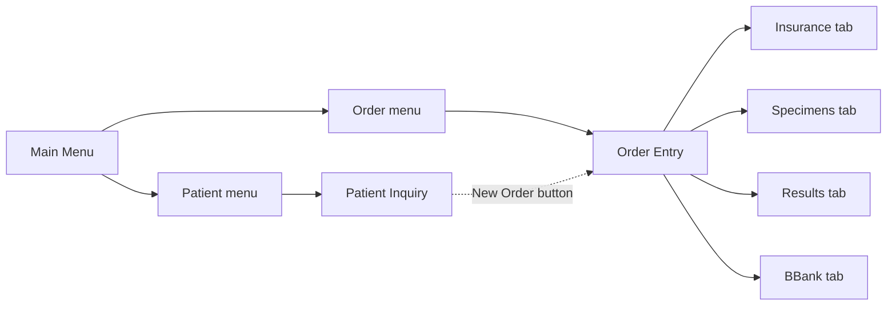

# Order Entry — SoftLab Patient Order Screen

The primary screen for placing or editing lab orders against a patient encounter. Combines patient identification, stay/encounter context, and order details on a tabbed form. Tabs across the middle let you toggle between **General** order info, **Insurance**, **Specimens**, **Results**, and **BBank** views (specimen/result counts shown in parens).

**Module:** SoftLab
**Mode:** EDIT (existing order open) or NEW
**Tables touched:** [V_P_LAB_PATIENT](../claude.md#v_p_lab_patient--patient-data), [V_P_LAB_STAY](../claude.md#v_p_lab_stay--stayvisit-information), [V_P_LAB_ORDER](../claude.md#v_p_lab_order--order-data), [V_P_LAB_ORDERED_TEST](../claude.md#v_p_lab_ordered_test--ordered-test-data) (in lower grid), [V_P_LAB_DIAGNOSIS](../claude.md), [V_P_LAB_MISCEL_INFO](../claude.md#v_p_lab_miscel_info--patientstayorder-additional-data) (Exp Disch)

## Screen

> **Note:** if the screenshot above doesn't render, save the SoftLab Order Entry screenshot to `ui_screens/order_entry_screen.png`. The field-to-column map below is the authoritative reference — the screenshot is for visual context only.

## Field-to-Column Map

### Patient section → `V_P_LAB_PATIENT`

| Visible Label | Type | Database Column | Notes |
|---------------|------|-----------------|-------|
| Last name | text | `V_P_LAB_PATIENT.LAST_NAME` | |
| first | text | `V_P_LAB_PATIENT.FIRST_NAME` | |
| middle | text | `V_P_LAB_PATIENT.MIDDLE_INITIAL` | Often blank in production |
| DOB | date | `V_P_LAB_PATIENT.DOB_DT` | Use this, not the deprecated `DATE_OF_BIRTHDEPRECATED` |
| Age | derived | (computed from DOB_DT) | Not stored — calculated for display |
| Chart # | text | **(TBD)** | Not in documented `V_P_LAB_PATIENT` columns |
| MRN | text | `V_P_LAB_PATIENT.ID` | Real MRNs match `^E[0-9]+$`. Test patients (TX, TMP, etc.) have other prefixes |
| Sex | dropdown | `V_P_LAB_PATIENT.SEX` | M / F / Not known |
| MPI | text | **(TBD)** | Master Patient Index — likely an external/HIS identifier |
| Patient Comm | checkbox | (TBD) | Indicates patient-level comment exists |
| SSN | masked | `V_P_LAB_PATIENT.SOCIAL_SECURITY` | |
| ESO | dropdown | **(TBD)** | Possibly Ethnicity / Spanish-Origin |
| Sp. | dropdown | **(TBD)** | Possibly Spanish/Speaker |
| Race | dropdown | `V_P_LAB_PATIENT.RACE` | |
| **More** button | button | — | Opens additional patient demographics dialog |

### Stay section → `V_P_LAB_STAY`

Tab counts at the top (`Insurance (n)`, `Specimens (n)`, `Results (n)`) reflect aggregate counts of related rows for the current stay.

| Visible Label | Type | Database Column | Notes |
|---------------|------|-----------------|-------|
| Att. Dr (code + name) | code+lookup | `V_P_LAB_STAY.ADMITTING_DOCTOR_ID` → `V_S_LAB_DOCTOR.LAST_NAME, FIRST_NAME` | Code in left field, resolved name in right field |
| Billing | text | `V_P_LAB_STAY.BILLING` | **Epic CSN** — unique per stay, never null. Denormalized to `V_P_LAB_ORDER.BILLING` as well |
| Account# | text | **(TBD)** | Likely SoftAR cross-link via `V_P_ARE_ACCOUNT` |
| Adm On (date + time) | date + time | `V_P_LAB_STAY.ADMISSION_DT` | **Caveat: can be in the FUTURE** for pre-scheduled outpatient visits |
| By | dropdown | **(TBD)** | Likely admitting user/source; possibly `V_P_LAB_STAY.ADMITTED_FROM_HIS` |
| Dis Date (date + time) | date + time | `V_P_LAB_STAY.DISCHARGE_DT` | NULL when discharge hasn't happened |
| Stay Comm | checkbox | indicator | Indicates `V_P_LAB_STAY.COMMENTS` (CLOB) has content |
| Ward (code + name) | code+lookup | `V_P_LAB_STAY.CLINIC_ID` → `V_S_LAB_CLINIC.NAME` | |
| Room | text | `V_P_LAB_STAY.ROOM` | Inpatient only — empty for outpatient stays |
| Bed | text | `V_P_LAB_STAY.BED` | Inpatient only |
| Diag (code) | dropdown | `V_P_LAB_STAY.DIAGNOSIS1_ID` | Structured ICD code; often blank for outpatient |
| Diagnosis (text) | text | `V_P_LAB_STAY.DIAGNOSIS_TEXT` | **Free-text description — workhorse for outpatient** when structured codes are blank |
| Pat. Type | dropdown | `V_P_LAB_STAY.HIS_PATIENT_TYPE` | Display values: `Inpatient` (I), `Outpatient` (O), `Emergency` (E), `Newborn` (N), `Home` (H) |
| Exp Disch | text | `V_P_LAB_MISCEL_INFO.VALUE` where `OWNER_ID = STAY.BILLING AND SUB_ID = 'Exp Disch'` | **Stored as misc info, NOT a column on V_P_LAB_STAY**. Used by the discharge-compliance reports |
| Fin Class | text | **(TBD)** | Financial class — likely SoftAR `V_S_ARE_FINCLASS` chain |
| HIS Patient Type | text | `V_P_LAB_STAY.HIS_PATIENT_SUBTYPE` **(probable)** | Distinct from `Pat. Type` field above; possibly the raw HIS-feed value vs the SCC-canonical mapping |

### Order section → `V_P_LAB_ORDER`

| Visible Label | Type | Database Column | Notes |
|---------------|------|-----------------|-------|
| Order (number) | text | `V_P_LAB_ORDER.ID` | Format `C` + 9 digits (assigned on save). Empty until insert |
| At (time + date) | time + date | `V_P_LAB_ORDER.ORDERED_DT` | Combined into the canonical DATE column |
| By | text | `V_P_LAB_ORDER.ORDERING_TECH_ID` | The user creating the order; matches login (status bar `User: RFE` ≈ `By: RFE` here) |
| Ord/Coll Loc. (code + name) | code+lookup | `V_P_LAB_ORDER.COLLECT_CENTER_ID` → `V_S_LAB_COLL_CENTER.SITE / NAME` | T1 = Temple, J1 = Jeanes, F1 = Fox Chase, etc. |
| Report To (4 slots) | 4× dropdown | `V_P_LAB_ORDERED_TEST.REPORTING_DOCTOR1_ID` … `REPORTING_DOCTOR4_ID` | Set at order level for default; persists per-orderable |
| Req. by | text | `V_P_LAB_ORDER.REQUESTING_DOCTOR_ID` | FK by code → `V_S_LAB_DOCTOR.ID` |
| Call | checkbox | **(TBD)** | Likely a bit in `V_P_LAB_ORDER.FLAGS` or a related call-list flag |
| Order Comm. | checkbox | indicator | Indicates `V_P_LAB_ORDER.COMMENTS` or `NOTES` (CLOBs) have content |
| Priority | dropdown | `V_P_LAB_ORDER.PRIORITY` | Display values: `Stat` (S), `Routine` (R), `Timed` (T) |
| Collect (date + time) | date + time | `V_P_LAB_ORDER.COLLECT_DT` | To-be-collected timestamp |
| Env | text | `V_P_LAB_ORDER.ENVIRONMENT` | Bitmask (NUMBER); `000` = no environment flags set |
| Insur (3 slots) | 3× dropdown | `V_P_LAB_ORDER.INSURANCE1_ID`, `INSURANCE2_ID`, `INSURANCE3_ID` | FK by code → `V_S_LAB_INSURANCE.ID` |
| Auth Num. | checkbox | indicator | Likely indicates an authorization number is attached (`V_P_ARE_VISIT.VTAUTHNO`) |
| Diag (4 slots) | 4× dropdown | `V_P_LAB_DIAGNOSIS` (separate join table — not on V_P_LAB_ORDER itself) | Order-test diagnosis associations |

### Ordered grid (lower) → `V_P_LAB_ORDERED_TEST`

The table at the bottom lists each orderable test attached to this order. The "Ordered (n)" tab label shows the count.

| Grid Column | Database Column | Notes |
|-------------|-----------------|-------|
| ID | `V_P_LAB_ORDERED_TEST.TEST_ID` | Test code (FK by code → `V_S_LAB_TEST_GROUP.ID`) |
| Name | `V_P_LAB_ORDERED_TEST.TEST_NAME` | Denormalized name (also resolvable via `V_S_LAB_TEST_GROUP.GTNAME_UPPER`) |
| Requesting | `V_P_LAB_ORDERED_TEST.DOCTOR_ID` | Per-test requesting doctor |
| Ord. date | `V_P_LAB_ORDERED_TEST.ORDERING_DT` | |
| Ord. time | `V_P_LAB_ORDERED_TEST.ORDERING_TIME` | NUMBER (HHMM) |
| Ord. tech | `V_P_LAB_ORDERED_TEST.TECH_ID` | Per-test ordering tech |

### Bottom toolbar buttons

| Button | Action |
|--------|--------|
| Insert | Add a new orderable test to the order |
| Cancel | Cancel the active editing (UI-level) |
| Cancel order | Cancel the entire order — sets `V_P_LAB_ORDER.TESTS_CANCEL = 'Y'` and writes rows to `V_P_LAB_CANCELLATION` (with `ORDERED_TEST_AA_ID` populated for each affected orderable) |
| Formulary | Open test formulary dialog (browse `V_S_LAB_TEST_FORMULARY`) |
| Keypad | Open keypad-based test entry (`V_S_LAB_KEYPAD` lookups) |
| Report To | Edit the report-to doctor list for the active orderable |

### Status bar (bottom of window)

| Item | Source |
|------|--------|
| User | The logged-in SCC user — drives `By` defaults and gets recorded in tech-ID columns on inserts |
| Env | SCC environment (LIVE2 = production, LIVE = legacy) |
| Site | Site code |
| Term | Terminal ID — registered in `V_S_LAB_TERMINAL.TERMINAL`. Drives specimen-tracking setup behavior via `V_S_LAB_SPTR_SETUP` |

## Navigation context

## Related views in the dictionary

- [V_P_LAB_PATIENT](../claude.md#v_p_lab_patient--patient-data) — patient demographics
- [V_P_LAB_STAY](../claude.md#v_p_lab_stay--stayvisit-information) — encounter / Epic CSN linkage
- [V_P_LAB_ORDER](../claude.md#v_p_lab_order--order-data) — order header
- [V_P_LAB_ORDERED_TEST](../claude.md#v_p_lab_ordered_test--ordered-test-data) — orderables grid
- [V_P_LAB_CANCELLATION](../claude.md#v_p_lab_cancellation--cancelled-testorderspecimen-records) — written when "Cancel order" is used
- [V_P_LAB_MISCEL_INFO](../claude.md#v_p_lab_miscel_info--patientstayorder-additional-data) — Exp Disch and other misc fields
- See also [Core SoftLab chain diagram](../schema_diagrams.md#1-core-softlab-patient-data-chain)

## Open questions / TBD

These fields couldn't be confidently mapped from the existing dictionary — would need verification by either running a discovery query against the relevant view or checking the SCC Forms Designer / source-of-truth setup config:

- **Patient.Chart #** — column unknown (could be `SECONDARY_ID` on patient, or HIS-source identifier)
- **Patient.MPI** — Master Patient Index source unknown (likely external system identifier; possibly stored in `V_P_LAB_PAT_KNOWNAS` or a HIS-mapping view)
- **Patient.ESO** and **Patient.Sp.** — short labels, likely Ethnicity/Spanish-origin and Speaker/Spanish; not in documented `V_P_LAB_PATIENT` columns
- **Stay.Account#** — likely SoftAR cross-link via `V_P_ARE_ACCOUNT`
- **Stay.By** (Adm On row) — admitting source/user
- **Stay.Fin Class** — financial class lookup
- **Stay.HIS Patient Type** (separate from Pat. Type) — probable `HIS_PATIENT_SUBTYPE` but unverified
- **Order.Call** checkbox — likely a `FLAGS` bit
- **Order.Auth Num.** checkbox — auth-number presence indicator; tie-in to `V_P_ARE_VISIT.VTAUTHNO` unverified
